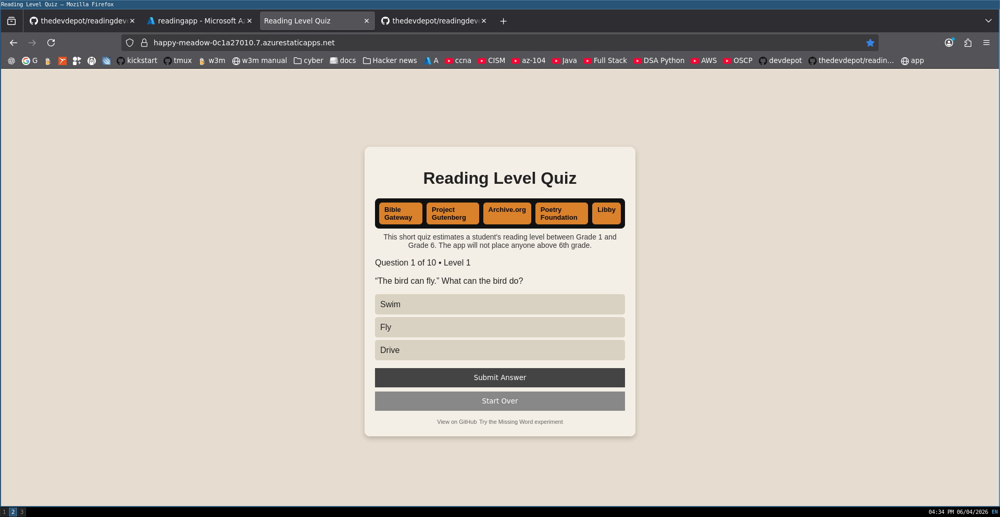
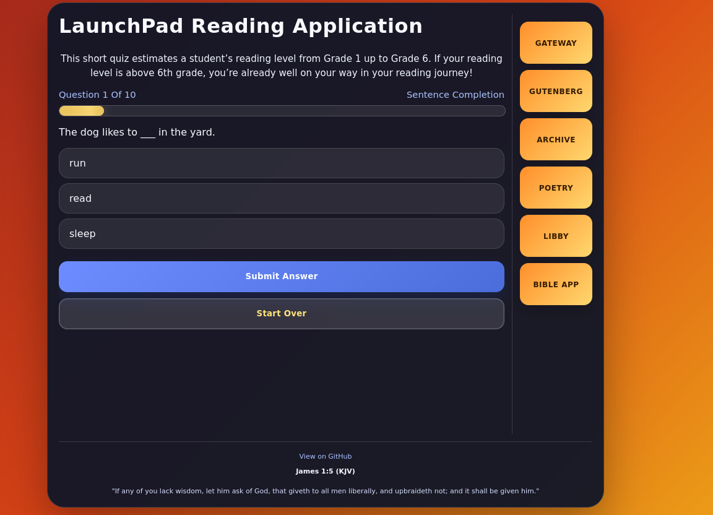
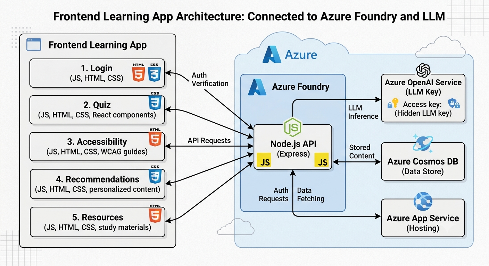

# Reading Time Warp


An adaptive reading assessment web application designed to estimate student reading level while keeping learners engaged through interactive question formats.

Live demo:
[https://happy-meadow-0c1a27010.7.azurestaticapps.net/](https://happy-meadow-0c1a27010.7.azurestaticapps.net/)

This project was built as part of the Azure Innovation Studio Agents League hackathon.

As a high school ELA teacher working with special education students, I wanted to build an assessment experience that feels less like a static test and more like an interactive learning environment. The design is inspired by tools like Pear Deck, Edpuzzle, Quizizz, Gimkit, and MagicSchool, while focusing on actionable classroom insights.

---

## Current Status

Reading Time Warp is currently in active prototype development and includes a working adaptive quiz flow with grade-level progression from 1 to 6.

What works now:

- Adaptive level progression based on student performance
- Mixed question-type assessment rotation
- Visual and text-based prompt support
- Progress tracking during assessment
- Reading recommendations aligned to estimated level
- Mobile-responsive experience with tailored interaction behavior for smaller screens

Planned soon:

- User authentication with Azure will be added in an upcoming update

Implemented question types in the current app:

- Multiple choice
- Sentence completion
- Sentence ordering
- Word matching
- Vocabulary in context
- Image description
- Keyword highlight (evidence-style word selection)
- Image selection
- Character emotion identification

---

## Screenshots




---

## Vision

Reading comprehension is more than selecting one correct answer from a list. This project is designed to grow into a multimodal assessment platform where students can demonstrate understanding in multiple ways.

Still planned question types:

- Text annotation
- Written response evaluation
- Author's purpose and intent analysis
- Paragraph writing activities
- Visual comprehension and drawing activities

The goal is to create a richer picture of student comprehension while maintaining strong engagement.

---

## Future AI Integration

A future phase of this project will integrate Large Language Models through REST APIs to evaluate open-ended student responses.

Potential use cases include:

- Evaluating text annotations
- Scoring written responses
- Providing feedback on vocabulary usage in context
- Assessing short paragraph responses
- Analyzing student-generated visual descriptions and drawings
- Generating personalized feedback and instructional recommendations

The focus will be on using AI to support educators, not replace teacher judgment.

---

## Technology Stack

Current implementation:

- HTML
- CSS
- JavaScript
- CSV and JSON question banks
- CSV recommendation data
- Azure Static Web Apps



Hackathon development tools:

- GitHub Copilot for rapid front-end development and refactoring support
- Azure Foundry Custom Agents for multimodal image description workflows tied to image-based question experiences

Future exploration:

- LLM-powered response evaluation
- Agentic API workflows
- Learning analytics and engagement insights
- Expanded adaptive assessment models

---

## Project Structure

```text
.
├── frontend/
│   ├── index.html
│   ├── script.js
│   ├── styles.css
│   ├── accessibility.html
│   ├── learning-strategies.html
│   ├── reading-resources.html
│   ├── sign-in.html
│   ├── multiple-choice-questions.csv
│   ├── sentence-completion-questions.csv
│   ├── vocabulary-in-context-questions.csv
│   ├── sentence-ordering-questions.json
│   ├── word-matching-questions.json
│   ├── image-description-questions.json
│   ├── image-select-questions.json
│   ├── keyword-highlight-questions.json
│   ├── character-emotion-questions.json
│   ├── recommendations.csv
│   └── staticwebapp.config.json
├── package.json
├── staticwebapp.config.json
└── README.md
```

---

## Planned Assessment Types

The long-term vision is to evaluate reading comprehension across multiple modalities rather than relying only on multiple choice.

### Phase 1: Structured Question Types (No AI Required)

These activities are scored with traditional logic and are prioritized for fast classroom usability.

| Priority | Question Type                    | Status      | Coding Difficulty | Storage Format | Reading Skills Measured                      | Reading-Level Value | Engagement |
| -------- | -------------------------------- | ----------- | ----------------- | -------------- | -------------------------------------------- | ------------------- | ---------- |
| 1        | Multiple Choice                  | Implemented | Very Easy         | CSV            | Literal comprehension, inference             | Medium              | Medium     |
| 2        | Vocabulary in Context            | Implemented | Easy              | CSV            | Vocabulary knowledge                         | Very High           | Medium     |
| 3        | Evidence Selection               | Implemented | Easy              | JSON           | Text evidence usage                          | High                | Medium     |
| 4        | Character Emotion Identification | Implemented | Easy              | JSON           | Inferencing, character analysis              | High                | High       |
| 5        | Image Selection                  | Implemented | Medium            | JSON           | Visualization, comprehension                 | High                | Very High  |
| 6        | Sequence Ordering                | Implemented | Medium            | JSON           | Narrative structure, sequence logic          | High                | High       |
| 7        | Word Matching                    | Implemented | Medium            | JSON           | Vocabulary depth, semantic relationship      | High                | High       |
| 8        | Cause and Effect Match           | Planned     | Medium            | JSON           | Logical comprehension, relationship tracking | High                | High       |

### Phase 2: AI-Assisted Question Types

These activities require LLM or agentic scoring workflows and are planned for deeper comprehension analysis.

| Priority | Question Type               | Status  | Coding Difficulty | Storage Format | Reading Skills Measured                | Reading-Level Value | Engagement |
| -------- | --------------------------- | ------- | ----------------- | -------------- | -------------------------------------- | ------------------- | ---------- |
| 9        | Short Constructed Response  | Planned | Easy              | JSON           | Written comprehension, inference       | Very High           | Medium     |
| 10       | Annotation                  | Planned | Medium            | JSON           | Evidence identification, close reading | Very High           | High       |
| 11       | Summary Generation          | Planned | Easy              | JSON           | Main idea, synthesis                   | Extremely High      | Medium     |
| 12       | Text-to-Image Description   | Planned | Medium            | JSON           | Mental visualization                   | High                | Very High  |
| 13       | Conversation with Character | Planned | Medium            | JSON           | Perspective taking, comprehension      | High                | Very High  |

### Why Multiple Modalities?

Research and classroom practice suggest that reading comprehension is better measured through a combination of:

- Literal comprehension
- Vocabulary knowledge
- Inferencing
- Evidence gathering
- Main idea identification
- Narrative understanding
- Visualization
- Written explanation
- Metacognitive reasoning

Rather than relying on a single format, this project aims to gather evidence across modalities and generate a more accurate reading-level estimate with better instructional recommendations.

> James 1:5 (KJV)
> If any of you lack wisdom, let him ask of God, that giveth to all men liberally, and upbraideth not; and it shall be given him.
